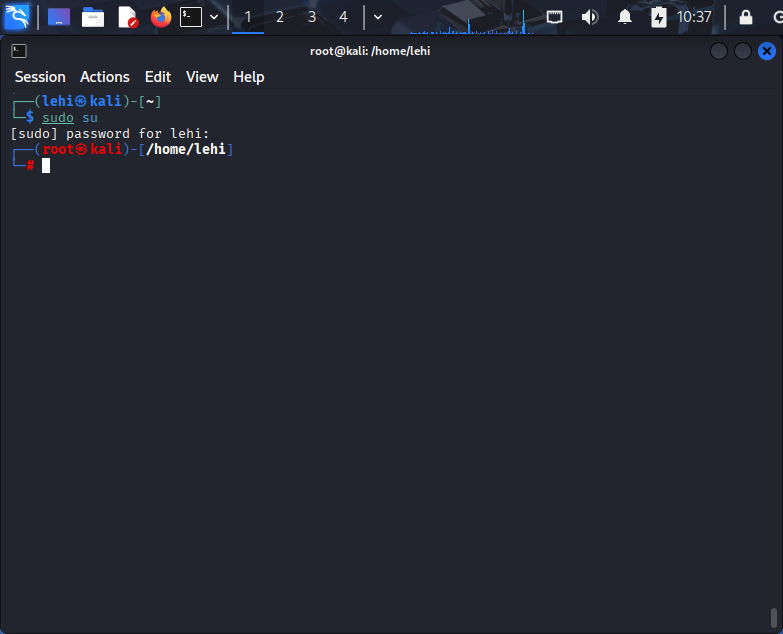
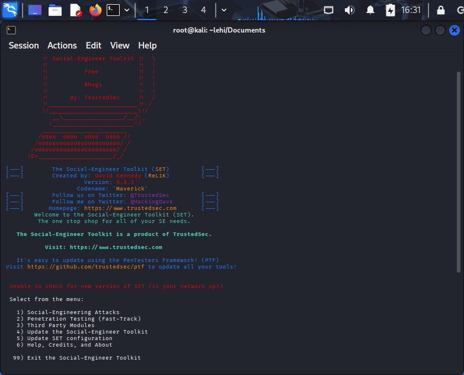
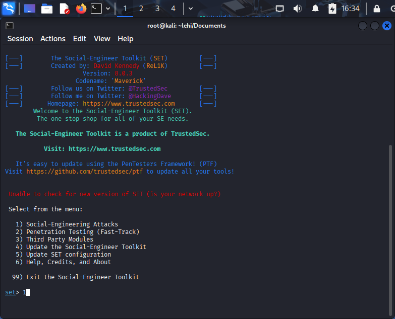
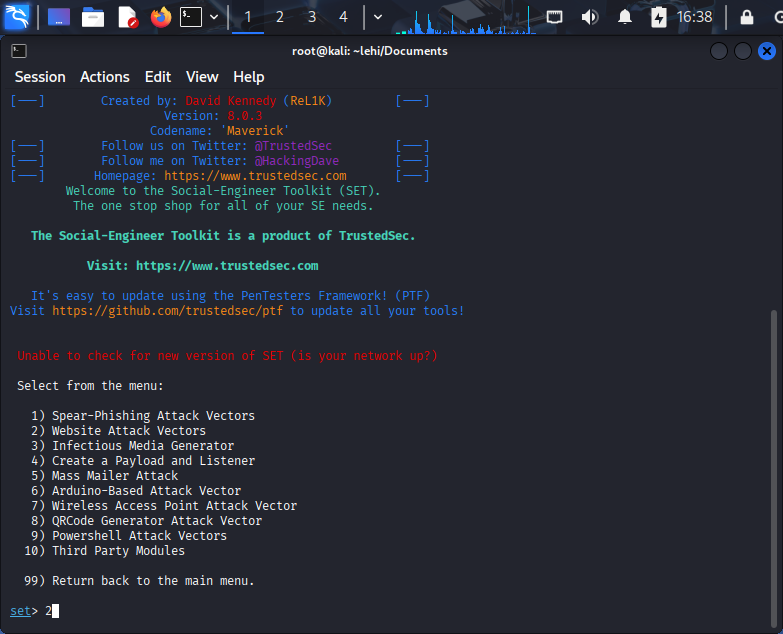
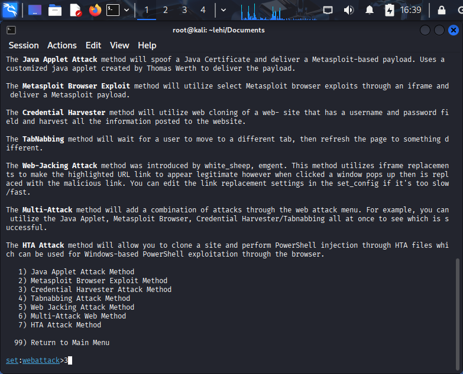
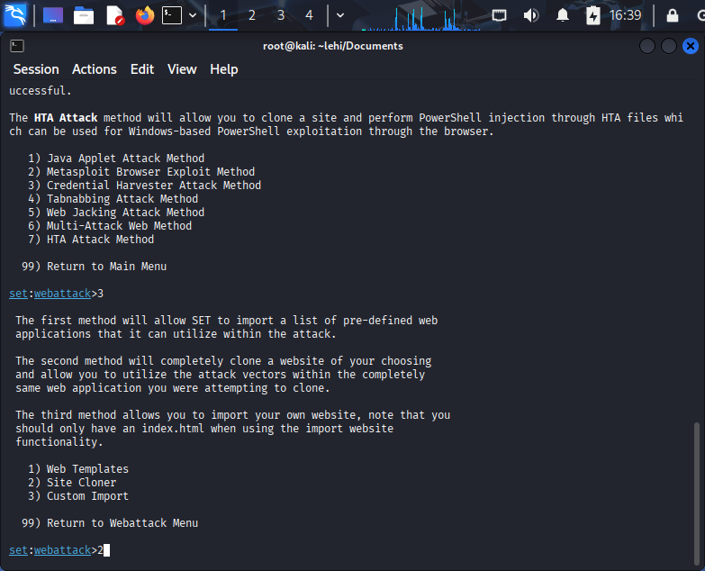
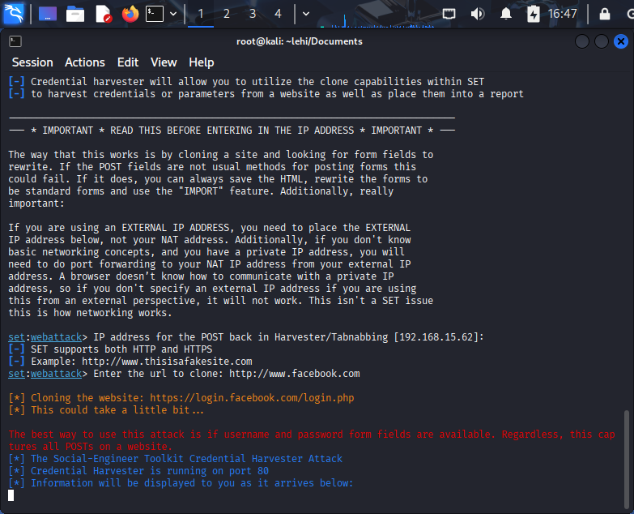
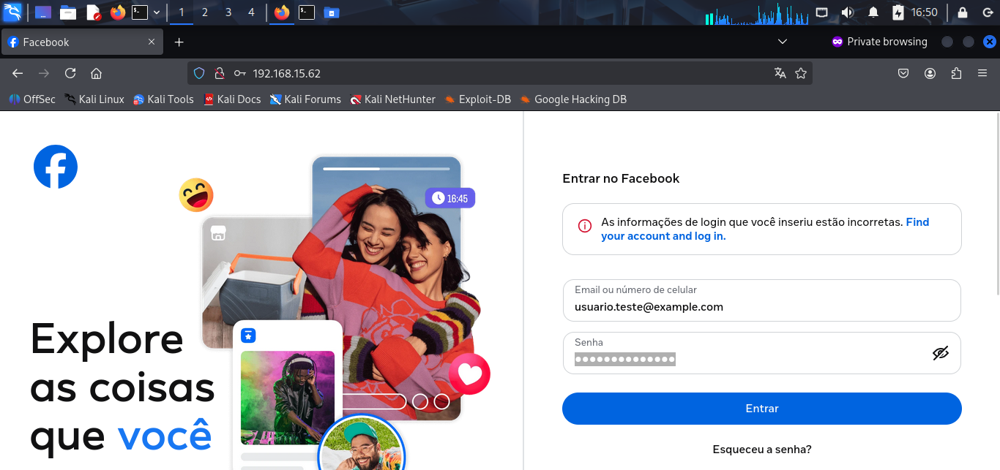
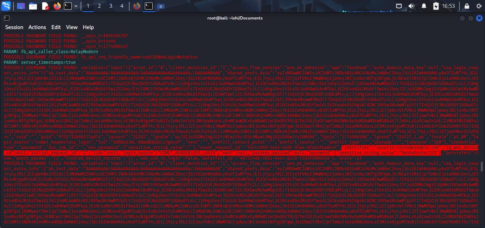

#### 🎯 Phishing Controlado com Kali Linux e SEToolkit


Laboratório educacional para simular um ataque de phishing em ambiente **controlado**, utilizando Kali Linux e a ferramenta SEToolkit. Projeto desenvolvido como parte de um desafio de cibersegurança da DIO.

> ⚠️ **Aviso de Responsabilidade** 
> Este projeto é estritamente para fins educacionais e de pesquisa em segurança. 
> É proibido utilizar as técnicas demonstradas aqui contra sistemas, contas ou redes de terceiros sem autorização explícita e por escrito. 
> O autor não se responsabiliza por qualquer uso indevido deste conteúdo.

## 🎯 Objetivo do Projeto

- Demonstrar, em ambiente controlado, como um ataque de phishing pode ser montado com o SEToolkit no Kali Linux.
- Documentar passo a passo o raciocínio técnico, configuração do laboratório e evidências da captura de credenciais de teste.
- Reforçar boas práticas de segurança e conscientização sobre engenharia social.

## 🛠️ Tecnologias Utilizadas

- **Kali Linux** para geração da página de phishing
- **SEToolkit (Social-Engineer Toolkit)** pré-instalado no Kali
- **Git e GitHub** para versionamento e publicação da documentação
- **FireFox** em **private window** para simular o usuário alvo
- **VirtualBox** para execução do Kali em máquina virtual

## 🧪 Cenário de Laboratório

- Máquina atacante: Kali Linux executando o SEToolkit.
- Máquina vítima: navegador acessando o IP do Kali em rede controlada.
- Todo o teste é feito apenas em ambiente autorizado.

## 📂 Estrutura do repositório

A organização dos arquivos foi pensada para separar claramente documentação, evidências e artefatos gerados durante o laboratório.

```text
phishing-controlado-kali-setoolkit/
├── README.md                 # Documentação principal do projeto
├── images/                   # Evidências em formato de imagem
│   ├── setoolkit-menu.png
│   ├── setoolkit-option-1.png
│   ├── setoolkit-option-2.png
│   ├── setoolkit-option-3.png
│   ├── setoolkit-option-4.png
│   ├── setoolkit-webpage.png
│   ├── setoolkit-test.png
│   └── setoolkit-result.png
└── docs/
    └── report-setoolkit.xml  # Relatório gerado durante o laboratório
```

Essa estrutura facilita a navegação de outros profissionais que queiram entender rapidamente como o projeto foi construído e onde estão as principais evidências.

## 🚀 Passo a passo do ataque controlado

> Este fluxo foi executado em ambiente de laboratório, apenas com máquinas e redes autorizadas.

1. **Acesso root no Kali**
   - No terminal:
     ```bash
     sudo su
     ```
   - Confirmar o prompt como `root@kali`.




2. **Iniciando o Social-Engineer Toolkit (SET)**
   - Ainda no terminal:
     ```bash
     setoolkit
     ```
   - Aceitar o termo de uso exibido pelo SET (caso apareça).

3. **Selecionando o tipo de ataque**
   - No menu principal do SET, escolher:
     - `1) Social-Engineering Attacks`
     - `2) Website Attack Vectors`
     - `3) Credential Harvester Attack Method`
     - `2) Site Cloner`
   - Esse fluxo permite clonar um site e capturar credenciais digitadas pelo usuário.

4. **Clonando a página de login do Facebook**
   - Quando o SET pedir a URL do site a ser clonado, informar:
     - `https://www.facebook.com`
   - O SET irá baixar a página de login e prepará-la para o ataque de coleta de credenciais.

5. **Acessando a página falsa no navegador**
   - No navegador (na própria máquina de laboratório), acessar:
     - No meu casp `http://192.168.15.62`
   - A página clonada de login será exibida ao usuário de teste.

6. **Capturando credenciais de teste**
   - Inserir **credenciais fictícias** (ex.: `usuario.teste@example.com` / `SenhaForte!123`) e clicar em “Login”.
   - Voltar ao terminal do SET e observar as credenciais sendo registradas no console e/ou nos relatórios.

7. **Encerrando o teste**
   - Após validar o funcionamento, encerrar o SET com `Ctrl + C` no terminal.
   - Guardar os logs apenas para fins de estudo e documentação do laboratório.

## 📸 Evidências do laboratório

Durante a execução do laboratório, foram registrados prints das principais etapas do processo, desde a abertura do SEToolkit até a captura das credenciais de teste em ambiente controlado.

### 🖥️ Inicialização do SEToolkit

A imagem abaixo mostra o menu principal da ferramenta SEToolkit no Kali Linux, ponto de partida para a seleção do vetor de ataque.



### 1️⃣ Seleção da opção inicial

Nesta etapa, foi selecionada a categoria **Social-Engineering Attacks**, responsável por agrupar os ataques de engenharia social disponíveis na ferramenta.



### 2️⃣ Vetores de ataque web

Em seguida, foi escolhida a opção **Website Attack Vectors**, utilizada para ataques baseados em páginas web falsas ou clonadas.



### 3️⃣ Captura de credenciais

Depois, foi selecionado o método **Credential Harvester Attack Method**, que permite registrar os dados enviados por um formulário web clonado.



### 4️⃣ Clonagem do site

Na sequência, foi utilizada a opção **Site Cloner**, responsável por copiar a estrutura visual da página-alvo para simular o login falso.



### 🌐 Página clonada em execução

A imagem abaixo mostra a página clonada em execução no navegador, acessada por meio do endereço IP local configurado no laboratório.



### 🧪 Teste de envio

Aqui foi realizado o teste com credenciais fictícias, simulando a interação do usuário com a página clonada em ambiente controlado.



### ✅ Resultado da captura

Por fim, o console do SEToolkit registrou os dados submetidos no formulário, demonstrando o funcionamento do ataque de coleta de credenciais em laboratório.



## 📄 Relatório gerado

Além das evidências visuais, o projeto inclui um relatório técnico exportado pela ferramenta durante a execução do laboratório:

- `docs/report-setoolkit.xml`

Esse arquivo complementa a documentação do experimento e pode ser utilizado para análise posterior dos resultados obtidos no ambiente de testes.

## 🧠 Análise dos resultados

A execução do laboratório demonstrou, de forma prática, como ataques de engenharia social podem explorar a confiança do usuário por meio da clonagem visual de páginas conhecidas. Utilizando o método **Credential Harvester** do SEToolkit, foi possível observar como credenciais digitadas em uma página falsa podem ser capturadas quando o usuário não valida corretamente a origem do site.

Outro ponto importante observado foi a simplicidade da execução em ambiente controlado. Mesmo com um fluxo relativamente direto dentro do SEToolkit, o impacto potencial desse tipo de técnica é alto, principalmente quando combinado com páginas familiares, pressa do usuário e ausência de mecanismos adicionais de autenticação.

Este experimento também reforçou a importância de documentar não apenas a execução da ferramenta, mas o contexto do ataque, os vetores utilizados e os possíveis impactos para usuários e organizações. Em um cenário real, técnicas como essa podem ser empregadas para roubo de credenciais, movimentação lateral e comprometimento inicial de contas corporativas.

## 🛡️ Medidas de prevenção

Para reduzir o risco de ataques de phishing e captura de credenciais, algumas medidas são fundamentais:

- Verificar cuidadosamente a URL antes de inserir qualquer dado sensível.
- Desconfiar de páginas de login acessadas por links recebidos por e-mail, mensagens ou redirecionamentos suspeitos.
- Habilitar **MFA** sempre que possível, preferencialmente métodos mais resistentes a phishing.
- Promover treinamentos de conscientização em segurança para usuários e colaboradores.
- Monitorar acessos suspeitos, falhas de autenticação e comportamentos anômalos em contas críticas.

Além das medidas para usuários finais, organizações devem investir em campanhas de conscientização, políticas de autenticação forte e simulações controladas de phishing para treinar equipes. A combinação entre tecnologia, processo e educação é uma das formas mais eficazes de reduzir a taxa de sucesso desse tipo de ataque.

## 📚 O que aprendi

Durante este desafio, aprendi na prática como o **SEToolkit** organiza vetores de engenharia social e como o método de **Credential Harvester** pode ser usado para simular a coleta de credenciais em um laboratório controlado. Também entendi melhor a lógica de clonagem de páginas, captura de dados e o papel do endereço IP local na exposição do serviço para teste.

Além do aspecto técnico, este projeto reforçou a importância da documentação clara no GitHub, incluindo README bem estruturado, evidências visuais, organização de pastas e registro dos resultados obtidos. Isso mostra não apenas execução técnica, mas também capacidade de comunicação e apresentação de um projeto de segurança.

Por fim, o laboratório ampliou minha percepção sobre o lado defensivo da cibersegurança. Mais do que executar uma técnica, o principal aprendizado foi compreender como esse tipo de ataque funciona para que seja possível identificá-lo, preveni-lo e conscientizar outras pessoas sobre seus riscos.

## 🔗 Referências

Alguns materiais consultados e recomendados para aprofundar o estudo sobre engenharia social, phishing e uso do SEToolkit:

- Desafio base da DIO – Criação de um phishing com o Kali Linux e SEToolkit.
- Repositório oficial do instrutor do desafio de phishing.
- Documentação e materiais sobre o Social-Engineer Toolkit (SET).
- Artigos e guias sobre phishing, engenharia social e medidas de prevenção.
- Conteúdos sobre MFA resistente a phishing e boas práticas de autenticação.
